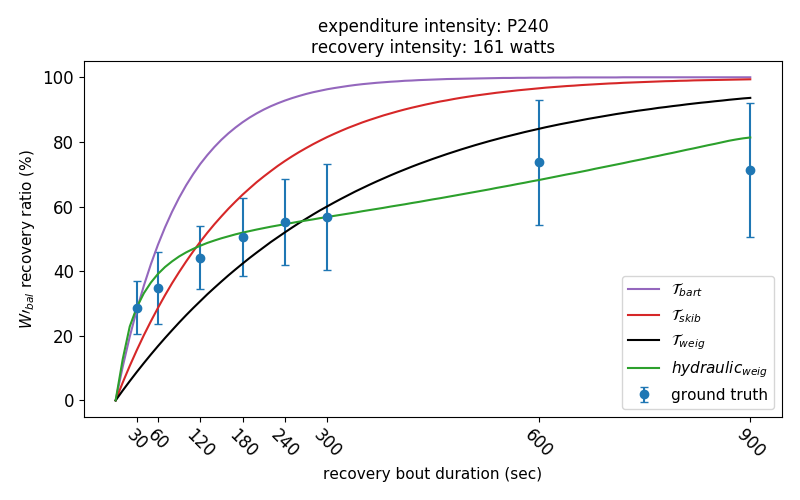
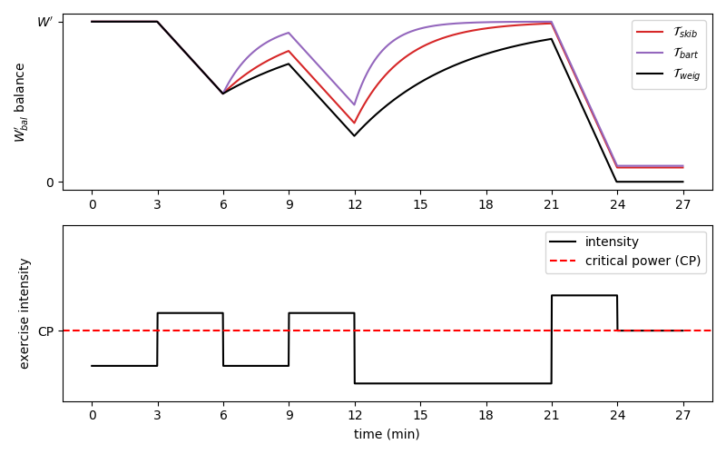

# pypermod

### Setup

If you simply want to use the package, you may want to install it via `pip3 install pypermod` without the need 
for a manual download. 

If you downloaded the source files, e.g., from this [GitHub repository](https://github.com/faweigend/pypermod), 
you can install the project with a similar procedure as a package by running `pip3 install -e <path_to_project_root>`.

