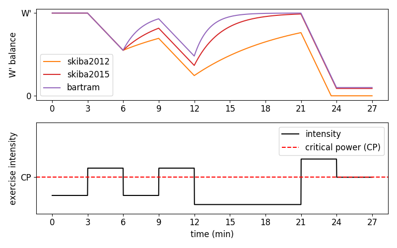

## Performance Modeling

### Setup

One of the requirements it the `three_comp_hyd` project, which has to be installed locally. 
Please get the source code from [here](https://github.com/faweigend/three_comp_hyd) and install via `pip`.

Full link to the repository: [https://github.com/faweigend/three_comp_hyd](https://github.com/faweigend/three_comp_hyd)