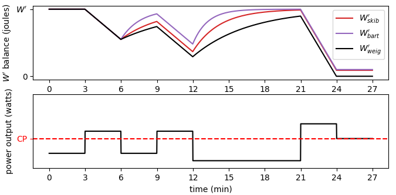

# pypermod

This python package provides various tools to predict energy expenditure and recovery dynamics of an athlete. 
The name `pypermod` stands for __Python Performance Modeling__.

More details on the purpose of this package can be found in our manuscript __A hydraulic model outperforms work-balance models for predicting recovery kinetics from intermittent exercise__. 
You can find the preprint on [arXiv](). We provide scripts in the `example_scripts` folder of our [GitHub_repository](https://github.com/faweigend/pypermod) to recreate all plots and comparisons of the manuscript.

### Setup

If you aim to use the package for your own analysis you may want to install it via `pip3 install pypermod` without the need 
for a manual download. 

If you aim to work on the source code you may clone the [GitHub_repository](https://github.com/faweigend/pypermod). 
You can install the files from the repository by running `pip3 install -e <path_to_project_root>`.

### Usage

Please see the scripts in the `example_scripts` 
folder of our [GitHub_repository](https://github.com/faweigend/pypermod) for exemplary comparisons and applications. Three types of example scripts are available:

#### Compare to Data

Scripts that have a name that starts with `compare` recreate comparison plots of the [manuscript](). You may use them to investigate the data we extracted from other studies or to see examples for how to use `pypermod` agents to predict recovery ratios.

#### Fitting Tau

Scripts that have a name that starts with `fitting` recreate the fitting process of time constants for W'bal-weig and Chidnok comparisons in our [manuscript](). You may use them to further investigate our approaches to derive these time constants and how fitted models perform.

#### Simulate

Scripts that have a name that starts with `simulate` use one or several models to simulate energy dynamics of an athlete during exercise. Use these scripts as examples for how to use `pypermod` for predictions.